# Project Summary

This project takes you step by step through the process of creating a fully functional version of Conway's Game of Life using p5.js.

The repo itself is the skeleton (starter files) which you can fork to your own repo. Instructions for turning on GitHub pages for a quick and easy shareable link to interact with your Game of Life page are also provided.

If you are not already familiar with p5.js, check out the [Play With p5.JS](https://github.com/extrajordanary/play-with-p5js) repo to play with p5.js in the browser while following along with video tutorials.

[TODO table of contents with links to each step](https://stackoverflow.com/questions/11948245/markdown-to-create-pages-and-table-of-contents)

## What is the Game of Life?
From the Wikipedia entry for [Conway's Game of Life](https://en.wikipedia.org/wiki/Conway%27s_Game_of_Life#Rules):

>The universe of the Game of Life is an infinite two-dimensional orthogonal grid of square cells, each of which is in one of two possible states, alive or dead, or "populated" or "unpopulated". Every cell interacts with its eight neighbours, which are the cells that are horizontally, vertically, or diagonally adjacent. At each step in time, the following transitions occur:

>- Any live cell with fewer than two live neighbours dies, as if caused by underpopulation.
>- Any live cell with two or three live neighbours lives on to the next generation.
>- Any live cell with more than three live neighbours dies, as if by overpopulation.
>- Any dead cell with exactly three live neighbours becomes a live cell, as if by reproduction.


>The initial pattern constitutes the seed of the system. The first generation is created by applying the above rules simultaneously to every cell in the seed—births and deaths occur simultaneously, and the discrete moment at which this happens is sometimes called a tick (in other words, each generation is a pure function of the preceding one). The rules continue to be applied repeatedly to create further generations.

Try out this [Interactive Game of Life](https://bitstorm.org/gameoflife/) to get a better idea of what you're about to build.

We're going to build one that starts out with just the basic functionality:


### Project Requirements

What will our Game of Life (GOL) program need to be able to do?

We'll implement the following requirements in steps so that the program always runs and we can see the improvements over time:

- draw a two-dimensional orthogonal grid of square cells
- keep track of each cell in the grid
- a cell can be in one of 2 states: dead or alive
- create an initial population to seed the grid with dead and alive cells
- get the 8 neighbors for any cell and count how many neighbors are alive
- change a cell to being alive or dead based on the rules
- transition all cells from one generation to the next at the same time

## Preparing Your Project

### Step 1 - Forking the Project on GitHub

If you don't already have a [GitHub](https://github.com) account, sign up for one now!

Visit the repo for the [project skeleton](https://github.com/extrajordanary/p5js-game-of-life), which has the basic files you'll need already set up for you. This will be the starting point from which you'll follow the tutorial steps to slowly build up the rest of the Game of Life functionality.

Fork the project skeleton to your GitHub account by clicking the "fork" button in the upper right corner of the page. This will create an exact copy of the repo on your own GitHub profile.

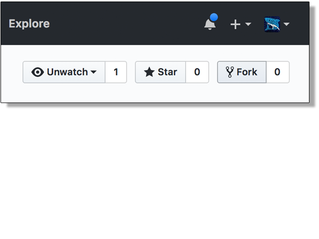

### Step 2 - Enabling GitHub Pages

Turning on GitHub pages for your repo will create a live hosted version of your project's `index.html` page, so that you'll have a real web address that others can visit to play your Game of Life.

Once you've forked the skeleton project, visit the new repo that was created on your own account.

Go to "Settings" and then scroll down until you see the "GitHub Pages" options. In the drop down, select `master branch` and then click "Save".


Now you'll be able to visit the live page at the url that it gives you in the settings. It should look like `https://your_user_name.github.io/your_repo_name/`

If you visit the link now, you should see the initial view with the plain gray canvas.

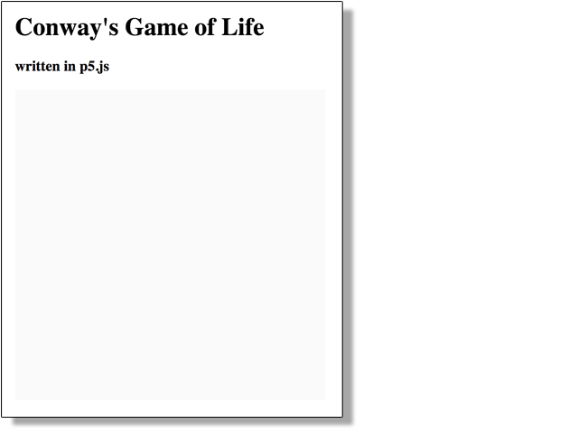

 You can also share this link to friends and family so they can see your progress and eventually your finished project!

### Step 3 - Editing and Viewing Changes Locally

Download the project to work on it locally.

[TODO add details for download steps]


You may use any editor you want (Atom, Sublime, etc).

To view your project locally, open your browser (Chrome, Safari, etc) and navigate to the path for `index.html`. The exact path will depend on where you saved the project when you downloaded it, but it will look something like this: `/Users/username/Files/Coding/p5js-game-of-life/index.html`

In Sublime you can right click in the file and copy the file path.

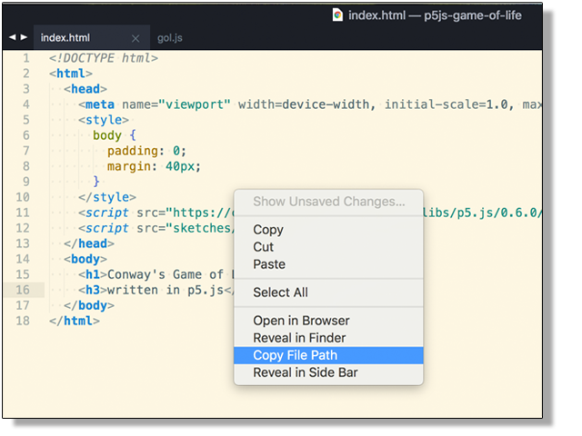

Paste the path into your browser and you should see the simple page with the canvas below. This should look exactly like what you saw when you visited your GitHub pages link.


As you edit and save the contents of `sketches/gol.js`, simply refresh the browser page (for the local path) to reload the sketch and see the changes.

### Step 4 - Saving Your Changes on GitHub

At the end of each step of this project, you will need to create a new commit and save it to your GitHub repo.

This is important for keeping a history of your changes for yourself and so that others can see your progress over time. This is similar to showing your work on a long math problem. We don't want to just show the final answer, we want to show the incremental work that went into creating the final product. It's also very helpful in case your code ever gets so broken that you want to go back a step and start over.

#### Using git

If you are not already familiar with using git and/or GitHub, you can check out the Product College prework [introduction to GitHub tutorials](https://github.com/MakeSchool/Product-College-Prework#git-and-github) and learn how to make git commits and push them to GitHub via the terminal.

Another option is to try out [GitHub Desktop](). You can follow [this tutorial](https://programminghistorian.org/lessons/getting-started-with-github-desktop) if you want a quick guide to working with the program.

**NOTE**
Learning how to use `git` is NOT the focus of this project, so if you find yourself getting stuck on this, please just skip the tutorials for now and use the following steps to save your changes directly in the browser.

#### OR save your changes to GitHub directly in the browser

1- Navigate to the file you want to save changes to
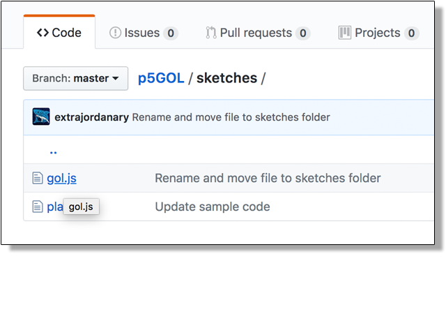

2- Click on the `edit` pencil button on the top right of the page
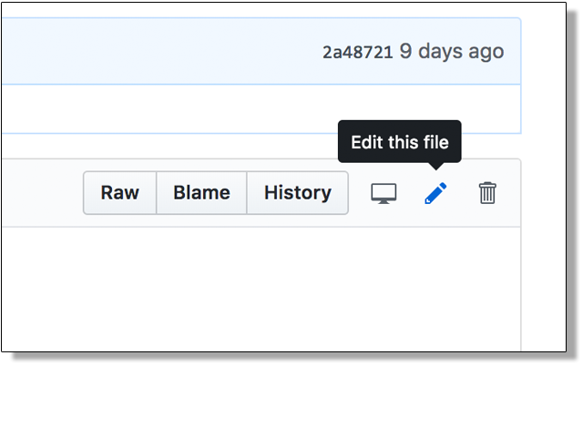

3- Copy your working code from your local edits, and paste it into the edit view on GitHub

4- Review the code you pasted, and once it looks good, commit the changes with a good commit message
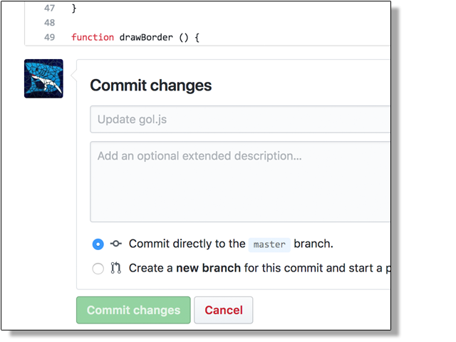

If you have correctly saved your changes to GitHub, you'll be able to visit/refresh your project's GitHub page and see your updated program live on the internet.

## Creating the Game of Life

For the rest of the tutorial, we'll be making edits to the `sketches/gol.js` file.

The skeleton project starts you out with the following code:

```javascript
var grid;

function setup () {
  createCanvas(400, 400);
  // grid = new Grid(20);
}

function draw () {
  background(250);

  // grid.draw();
}

class Grid {
  constructor () {
    // update the contructor to take cellSize as a parameter
    // use cellSize to calculate and assign values for numberOfColumns and numberOfRows
  }

  draw () {
    for (var column = 0; column < this.numberOfColumns; column ++) {
      for (var row = 0; row < this.numberOfRows; row++) {
        fill(240);
        noStroke();
        rect(column * this.cellSize + 1, row * this.cellSize + 1, this.cellSize - 1, this.cellSize - 1);
      }
    }
  }
}
```


### Step 1

We already have a `Grid` class with a `draw` function. Now, we want to give the `Grid` class a constructor parameter `cellSize` so that it can automatically calculate how many columns and rows it should have based on the canvas `width` and `height`.

#### Check

When you are done, uncomment/re-enable the other lines of code in `setup` and `draw` (remove the `//` in front of the code) and confirm that you now see a grid of 20x20 cells in your canvas.

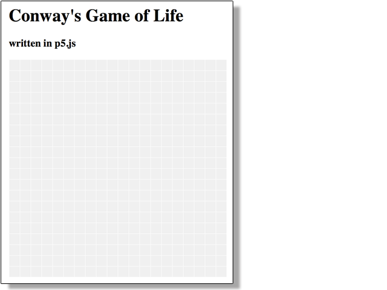

**IMPORTANT**
Save your changes to GitHub! Use good commit messages, like "Finish step 1, update the grid constructor"

### Step 2

Now we need to add a way to keep track of the contents of each cell in the grid. At the bottom of the constructor, we need to create and assign a 2D array to `cells`.
First assign `cells` to a new array with length equal to `numberOfColumns`. Then, for each position in the array, assign it to another new array with length equal to `numberOfRows`.

Here's one way to create a 2D array:

```javascript
var x = 2; // how big the first array should be
var y = 2; // how big each array inside of the first array should be
var twoDArray = new Array(x);
for (var i = 0; i < twoDArray.length; i ++) {
  twoDArray[i] = new Array(y);
}
```

#### Check

Add `print(this.cells)` at the end of the constructor. Check that the console prints out `Array(20)` (you should also be able to expand it and see that each position also holds an empty array).

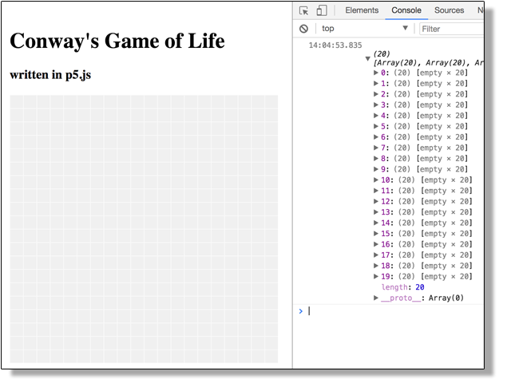

**IMPORTANT** Save your changes to GitHub! Use good commit messages, like "Finish step 2, track cells in grid"

### Step 3

Right now our grid has an array of arrays to keep track of cells, but we need some cells to put in it. Let's start by creating a basic `Cell` class. Each cell should have a `column`, `row`, and `size` - ensure the constructor takes these as parameters.

Additionally, each cell can be either alive or dead, so let's add a boolean property to keep track of it called `isAlive`. Inside the constructor, have every cell start off dead (`isAlive` should be `false`).

Once you have the basic `Cell` class added, paste the following code just above `print(this.cells)` from the last step:

```javascript
for (var column = 0; column < this.numberOfColumns; column ++) {
  for (var row = 0; row < this.numberOfRows; row++) {
    this.cells[column][row] = new Cell(column, row, cellSize)
  }
}
```
This code will go into each position in the 2D array and create a new `Cell`.

#### Check

Refresh the page and check that the console now shows a `Cell` and it's values instead of empty arrays.

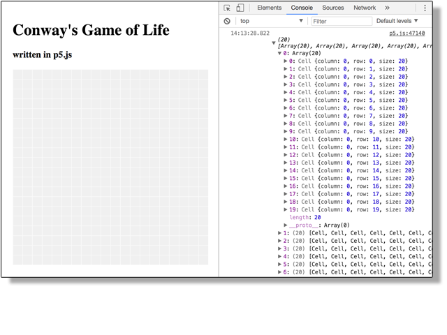

**IMPORTANT** Save your changes to GitHub! Use good commit messages, like "Finish step 3, create Cell class"

### Step 4

Now that our grid can keep track of all of it's cells, let's start adding more functionality to the cell. To start, let's give `Cell` it's own `draw` function, so that it will be responsible for it's own appearance based on whether it is dead or alive.

Inside of `Grid.draw`, remove everything inside of the nested for loop and paste it inside of the new `Cell.draw` function. Be sure to update the variables from the copied code to use `this` and to match the property names within the cell class (`column` -> `this.column`, etc).

Back in the `Grid.draw` for loop, instead, get the cell from `this.cells` and call `draw` on it. When you re-run your program, everything should look exactly the same, but now each cell is drawing itself.

If you get errors, use them to help guide you to where you still need to make changes, as they will often give you a line number and indicate which variable it couldn't find.

Finally, replace `fill(240);` with an `if else` statement to change the `fill` color depending on if the cell is alive or dead. You may choose any colors you like, but this tutorial will use `color(240)` for dead cells, and `color(200,0,200)` for alive cells.

#### Check

Temporarily change `this.isAlive = false;` to `this.isAlive = true;` inside of the cell constructor and confirm that your `if` statement is correctly assigning colors depending on the cell's value.

All cells dead:


All cells alive:

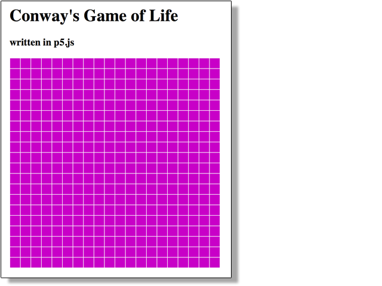

**IMPORTANT** Save your changes to GitHub! Use good commit messages, like "Finish step 4, cell draws itself"

### Step 5

Starting all the cells as all dead or all alive isn't very exciting. First let's add a function to `Cell` that we can call to set the value of `isAlive` directly. Add a new function to `Cell` called `setIsAlive`, that takes a paramenter `value`. If `value` is true, assign `isAlive` to true, otherwise set it to `false`.

Now we want to add a new function `randomize` to `Grid`. It should loop over all of it's cells just like the `draw` function. But instead of calling `draw` on the cell, we want to call `setIsAlive` and pass it a value that will evaluate to `true` or `false`.

We can use `random` to help us. Since `0` is treated as `false` and `1` is treated as `true`, we can do `floor(random(2))` and pass the result to `setIsAlive`. `random(2)` will create random decimals between 0 and 2, and `floor` turns it into an integer by dropping everything after the decimal.

You can try `print(random(2));` and `print(floor(random(2)));` to see the results in the console.

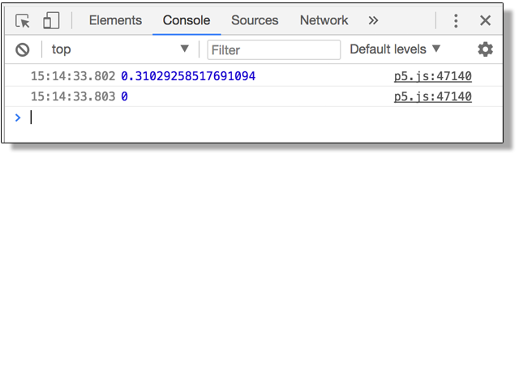

Finally, add `grid.randomize();` to the bottom of the `setup` function.

#### Check
Each time you run the program, you should now be seeing a mix of dead and alive cells.

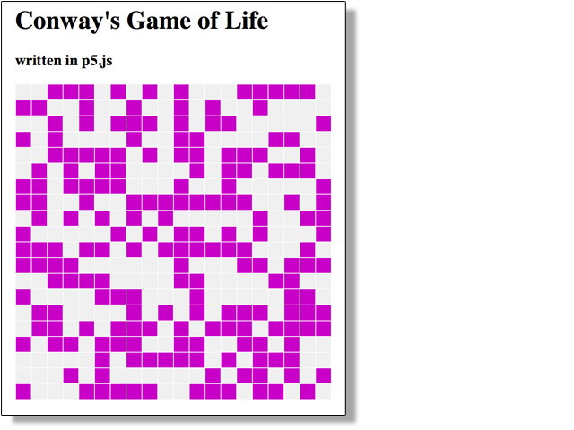

**IMPORTANT** Save your changes to GitHub! Use good commit messages, like "Finish step 5, randomize starting cells"

### Step 6
We are ready to start adding the logic for how the population will change over time, based on the following rules:

- Any live cell with fewer than two live neighbours dies, as if caused by underpopulation.
- Any live cell with two or three live neighbours lives on to the next generation.
- Any live cell with more than three live neighbours dies, as if by overpopulation.
- Any dead cell with exactly three live neighbours becomes a live cell, as if by reproduction.

Notice that each line expresses some conditional logic based on two properties: whether the cell is currently dead or alive, and how many of the neighboring cells are alive. We already have the ability to check if a cell is dead or alive, but now we need to add some code that will help us to count a cell's living neighbors.

First, add a new property to `Cell` to store `liveNeighborCount` and initialize it as `0` on creation.

Now let's add a new function called `updateNeighborCounts` to the `Grid` class and call it before `grid.draw`. We want this function to loop over all of the cells, count how many of it's neighbors are alive and then update `liveNeighborCount` for each one. Here's an outline of what the function needs to do:

```javascript
updateNeighborCounts () {
  // for each cell in the grid
  // reset it's neighbor count to 0
  // for each of the cell's neighbors, if it is alive add 1 to neighborCount
}
```

Notice there are two "for each" comments here. That's a clue that this method will include at least 2 nested for loops - once to look at each cell, and another to look at each neighhor of the cell. One of the hardest parts of this function will be answering the question: how do we get the cell's neighbors?

Let's look at an example with a much smaller grid. If a cell is at position `1,1` in the grid, it's neighbor cells will be the 8 surrounding cells in the grid.

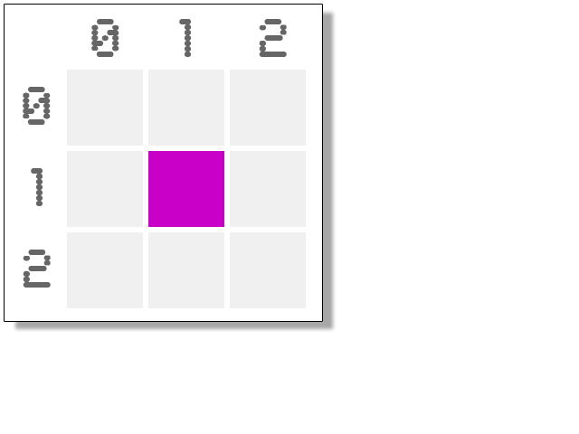

You can see that the x-values for neighbor cells are either 1 less, the same, or 1 more than the current cell's x position. The same is true for the y-values.

So, given `currentCell`, the way to loop through all 9 x, y positions around and including the cell, the code would look like this:

```javascript
for (var xOffset = -1; xOffset <= 1; xOffset++) {
  for (var yOffset = -1; yOffset <= 1; yOffset++) {
    var neighborX = currentCell.column + xOffset
    var neighborY = currentCell.row + yOffset

    // do something with neighborX and neighborY
  }
}
```

You can use the above code to help get you started, but you'll still have to add in more code to handle a few different edge cases:

- this code will loop over 9 cells, including the current one, so be sure not to count the current cell as one of it's neighbors
- to avoid errors, your code shouldn't try to access grid locations that don't exist

Example: Ensure that your code doesn't try to access any non-existant neighbors in column `-1`!
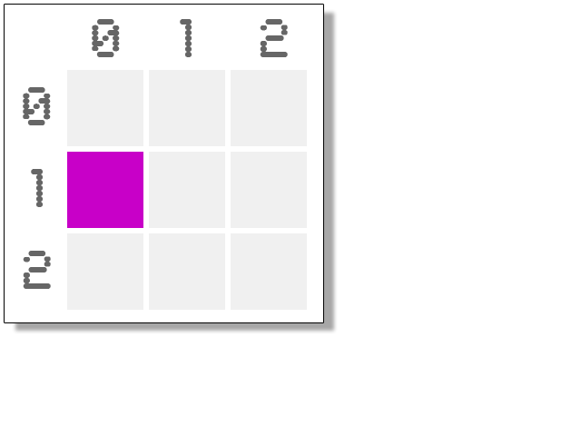

#### Check
Add `print(currentCell.liveNeighborCount)` at the end of looping through it's neighbors and check in the console that the numbers look right. they should all be between 0 and 8.

**IMPORTANT** Save your changes to GitHub! Use good commit messages, like "Finish step 6, update neighbor counts"

### Step 7
We're finally ready to apply the logic to each cell to determine whether it should be dead or alive in the next generation.

We want the `Grid` class to loop over each cell again (you should be very comfortable with these nested loops by now) and tell the cell to determine if it will be dead or alive. But we want the `Cell` class to be responsible for knowing the exact logic and handling it's own life or death.

Add an `updatePopulation` function to `Grid` and call it after `updateNeighborCounts` and before `draw`. Inside the method, loop over each cell and call `liveOrDie` on it.

Now make `liveOrDie` as a function in the `Cell` class. Here is where you now need to add some conditional logic for the cell to look at it's values for `isAlive` and `neighborCount` and determine what to change `isAlive` to.

- Any live cell with fewer than two live neighbours dies, as if caused by underpopulation.
- Any live cell with two or three live neighbours lives on to the next generation.
- Any live cell with more than three live neighbours dies, as if by overpopulation.
- Any dead cell with exactly three live neighbours becomes a live cell, as if by reproduction.

#### Check
Your game should be fully functional now! Try decreasing the cell size when you create the grid to see a larger population of cells on the screen at once to confirm that the population changes as expected.


**IMPORTANT** Save your changes to GitHub! Use good commit messages, like "Finish step 7, population updates"

### Step 8+
Try extending the functionality of the game.

Here are some ideas:

Allow the user to...

- pause the game
- manually turn cells on or off
- re-randomize the population without refreshing the page
- adjust how fast the population changes (slower would allow you to see the changes more easily)
- display text for the current number of living cells
- display text for how many generations have occurred
- *or create your own modification!*

**IMPORTANT** Save your changes to GitHub! Continue to use good commit messages!
